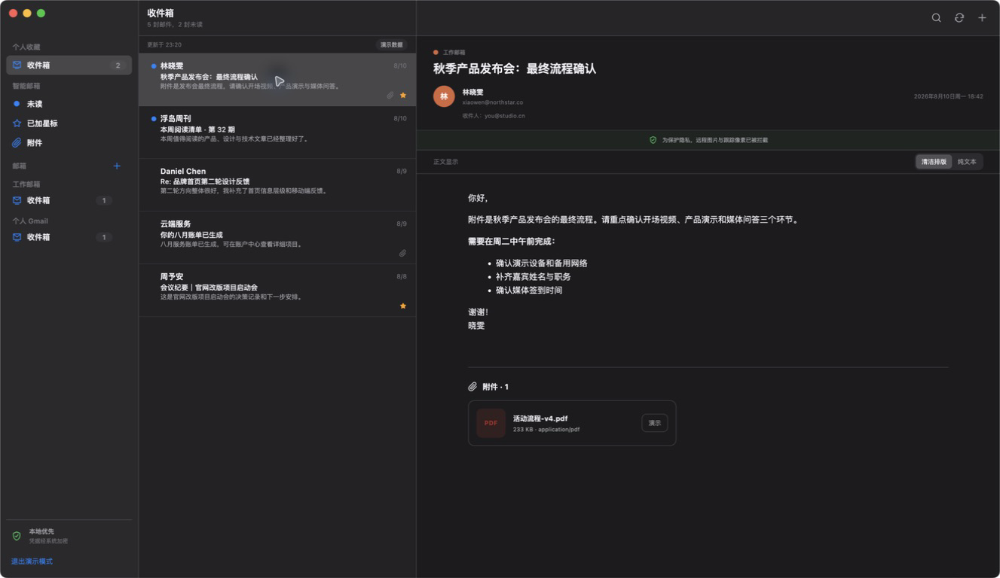

# Mail

一个面向 Windows 的多邮箱阅读器。它通过 IMAP 连接邮箱，在本机汇总、搜索和查看邮件。



## 当前版本

这是 `0.1.0` MVP，已经包含：

- 多个 IMAP 邮箱账号
- Gmail、iCloud、Yahoo、QQ、网易和自定义 IMAP 预设
- 统一收件箱、按账号筛选、主题和发件人搜索
- 未读、星标和带附件邮件筛选
- 邮件正文与附件信息查看
- 清洁 HTML / 纯文本正文切换
- 用户确认保存路径后按需下载附件
- 账号密码经 Electron `safeStorage` 加密；Windows 上使用 DPAPI
- 只读方式打开 IMAP 收件箱
- 清洗邮件 HTML，拦截脚本、事件处理器和远程跟踪图片
- 内置演示数据，不添加真实邮箱也能查看界面
- 参照 macOS Mail 的三栏比例、侧栏分组、邮件密度与融合标题栏
- 无品牌主页，自动跟随系统浅色/深色外观

当前版本不会发送、移动、删除或标记服务器上的邮件。

## Windows 安装

下载并解压 `Mail-0.1.0-x64.zip`，然后双击其中的 `Mail.exe` 即可运行。

如果拿到的是安装版，双击 `Mail-0.1.0-x64.exe`，按安装向导完成即可。

由于这是未签名的开发版，Windows SmartScreen 可能显示警告。正式发布前应购买代码签名证书并为安装包签名。

## 添加邮箱

大多数邮箱已经不允许第三方客户端直接使用普通登录密码：

- Gmail：开启两步验证后生成“应用专用密码”。
- iCloud：在 Apple ID 登录与安全设置中生成 App 专用密码。
- QQ / 网易：在邮箱设置中开启 IMAP，并生成授权码或客户端密码。
- Outlook / Microsoft 365：多数账号要求 OAuth 2.0；本 MVP 尚未完成 OAuth，只有仍允许应用密码的账号可以连接。

切勿把主账号密码提交给来源不明的软件。使用专门生成、可以单独撤销的应用密码。

## 本地开发

要求 Node.js 20.19+ 或 22.12+，推荐 pnpm。

```bash
pnpm install
pnpm dev
```

检查项目：

```bash
pnpm typecheck
pnpm test
pnpm build
```

生成 Windows x64 免安装 ZIP（支持在 macOS 交叉构建）：

```bash
pnpm dist:win
```

在 Windows 或装有 Rosetta 的 Intel 兼容构建环境中生成 NSIS 安装程序：

```bash
pnpm dist:win:installer
```

生成文件位于 `release/`。

## 安全设计

- Renderer 启用 `contextIsolation` 和沙箱，关闭 Node.js 集成。
- Renderer 只能调用 preload 暴露的最小 IPC 接口。
- 已保存的 IMAP 凭据解密后不会回传 Renderer。
- TLS 最低版本为 1.2，拒绝无效证书。
- 账号密码用操作系统安全存储能力加密后写入应用数据目录。
- 邮件正文经过允许列表清洗；图片标签默认移除，防止远程跟踪像素。
- 外部链接交由系统默认浏览器打开。

账号删除只会清除本机连接配置，不会修改邮箱服务器上的任何邮件。

## 下一阶段建议

1. Gmail OAuth 2.0（Authorization Code + PKCE）。
2. Microsoft OAuth 2.0 / Entra ID。
3. SQLite 本地索引、增量同步与离线搜索。
4. 系统托盘、新邮件通知、线程视图。
5. Windows 代码签名、自动更新和隐私政策。

## 许可证

MIT
